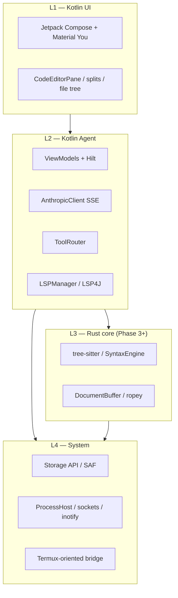

<!-- PRESERVATION RULE: Never delete or replace content. Append or annotate only. -->

# ARCHITECTURE — Kinetic

**Canonical narrative:** See `claude_ide_recommendation.html` in the repository root for full copy, chips, and code sketches.

## Layer stack (overview)

_Note: L3 is optional in Phase 1; Kotlin substitutes until JNI migration._

## Agent request flow (logical)

User input (Compose) → Agent layer (stream) → Tool dispatch → Filesystem / processes (L4).

## Key modules (name → responsibility)

| Module | Layer | Role |
|--------|-------|------|
| `CodeEditorPane` | L1 | Editor surface, gutter, selection, later Canvas |
| `AgentChatPanel` | L1 | Streaming markdown, tool visualization |
| `AnthropicClient` | L2 | OkHttp SSE, tool use, Flow to UI |
| `ToolRouter` | L2 | Map API tool names to FS / process / (later) Rust |
| `SyntaxEngine` | L3 | Incremental parse, token spans |
| `DocumentBuffer` | L3 | Rope, undo, serialization |
| `LSPManager` | L2 | Spawn LS, LSP over stdio |
| `ProcessHost` | L4 | Commands, streams, cwd, timeouts |

## Build phases (summary)

1. **Foundation** — Compose shell, SAF tree, basic editor, Anthropic + file tools, Termux:API terminal, Kotlin highlighting.
2. **Intelligence** — Tool router completion, LSP, diagnostics, hover, git, agent UX.
3. **Performance** — Rust via JNI, rope + tree-sitter, fuzzy search, custom canvas editor, tablet/foldable polish.

## L1 presentation (product)

The **Kinetic Syntax** visual system (`stitch_sample_1/`) maps to Compose: nav rail, editor chrome, AI sidebar, terminal strip — same four-layer architecture; presentation is intentionally opinionated for tablet density and AI adjacency.

## Build pipeline (Gradle / AGP 9)

- **Android application plugin** (`com.android.application`) drives compilation; **Kotlin** for Android sources is handled by **AGP built-in Kotlin** (do not apply `org.jetbrains.kotlin.android`).
- **Compose:** `org.jetbrains.kotlin.plugin.compose` (compiler aligned with Kotlin 2.3.x).
- **DI:** Dagger **Hilt** at runtime; **KSP** generates Hilt/Dagger bindings at compile time (`hilt-compiler` on the `ksp` configuration). This replaces historical **kapt** usage under built-in Kotlin.
- **JVM target:** Prefer `android.compileOptions` (Java 17); avoid legacy `android.kotlinOptions` unless you add a top-level `kotlin { compilerOptions { ... } }` block per [Kotlin Gradle docs](https://kotlinlang.org/docs/gradle-compiler-options.html).

---

*[2026-03-28]: Initial architecture doc derived from blueprint HTML.*

*[2026-03-28]: [AMENDED] L1 presentation note (Kinetic Syntax / stitch sample).*

*[2026-03-29]: [AMENDED] Build pipeline section (AGP 9 built-in Kotlin, Compose plugin, KSP/Hilt).*
