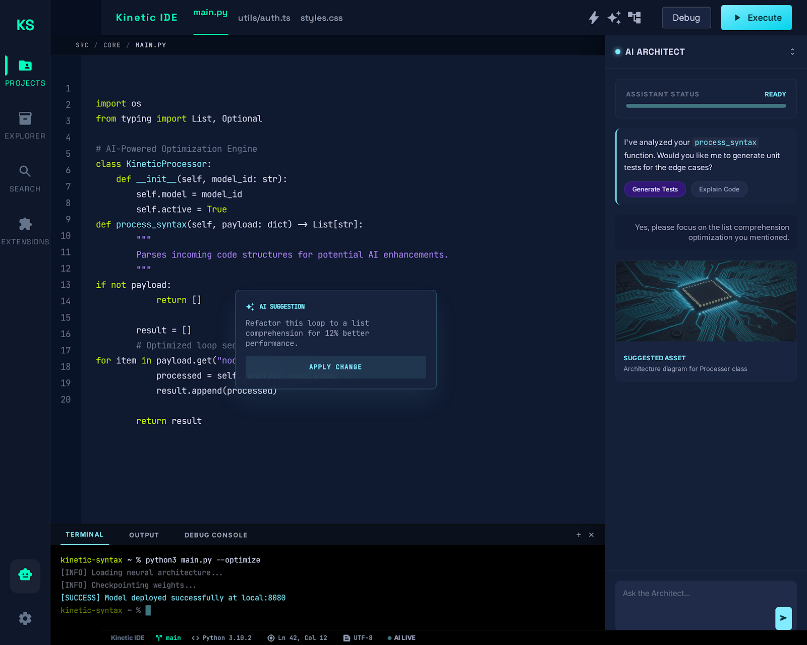

# Kinetic

**Tablet-first Android IDE** with an AI agent loop: split editor, SAF workspace, streaming tools, and the **Kinetic Syntax** UI in Jetpack Compose.

[](https://developer.android.com/)
[](https://kotlinlang.org/)
[](https://gradle.org/)
[](https://developer.android.com/build)
[](app/build.gradle.kts)


---

## Preview

Design reference (Kinetic Syntax — `stitch_sample_1`):

<p align="center">
  
</p>

<p align="center">
  <sub>Concept mock · Compose implementation lives in <code>app/</code></sub>
</p>

---

## Features (Current MVP)

| Area | What’s in the app |
|------|-------------------|
| **Workspace** | Startup gateway, recent workspaces, starter projects, SAF-backed open folder flow, inline capability banners |
| **Editor** | Multi-tab surface, undo/redo, autosave, dirty guards, large-file fallback, line gutter + breadcrumbs |
| **Agent** | Claude + Gemini chat, in-app API key settings, prompt enhancement, tool cards, receipts, apply/revert for file edits |
| **Tools** | `list_files`, `read_file`, `write_file`, `edit_file`, `search_files`, `create_directory`, `rename_path`, `delete_path`, `run_command` |
| **Git** | HTTPS token clone, saved auth, repo status, AI commit messages, commit, tracked-branch push |
| **Shell** | In-app workspace runner with execute, rerun, cancel, clear, and terminal/output/debug panes |
| **Trust** | App-wide Auto / Ask / Deny policies for file changes, destructive ops, and shell commands |
| **DI** | Hilt + **KSP** (AGP 9 built-in Kotlin) |

Roadmap: LSP, richer diagnostics/navigation, PTY/debugger-grade terminal work, deeper git flows,
and Rust/NDK core — see [`claude_ide_recommendation.html`](claude_ide_recommendation.html) and
[`DOCS/ARCHITECTURE.md`](DOCS/ARCHITECTURE.md).

## Current limits

- Clone, git, and command execution currently require shared-storage workspaces that resolve to real
  filesystem paths and usually need Android **All files access**.
- The runner uses Android-accessible `/system/bin/sh`; it is intentionally a bounded foreground
  command runner, not yet a PTY terminal or debugger host.
- LSP, diagnostics, go-to-definition, hover, and richer project-wide navigation are still roadmap
  work.

---

## Quick start

```bash
# 1. Secrets & SDK path
cp local.properties.example local.properties   # or copy manually on Windows
# Edit local.properties: sdk.dir=...; API keys can also be added inside the app.

# 2. Debug APK
./gradlew :app:assembleDebug
```

Windows:

```bat
copy local.properties.example local.properties
gradlew.bat :app:assembleDebug
```

Output: `app/build/outputs/apk/debug/app-debug.apk`

---

## Requirements

| Requirement | Notes |
|-------------|--------|
| **JDK 17+** | Must be a **full JDK** (`jlink` on `PATH` / `bin`) — AGP 9 uses it for `androidJdkImage` |
| **Android SDK** | e.g. Android Studio or `sdkmanager`; `compileSdk` / `targetSdk` **35** |
| **Network** | First resolve of Maven/Google artifacts |

### Cursor / VS Code and “`jlink` does not exist”

The Red Hat Java extension can run Gradle on a **bundled JRE** without `jlink`. This repo sets:

- [`gradle.properties`](gradle.properties) → `org.gradle.java.home` (adjust path for your machine; Linux/macOS/CI may need a different JDK path)
- [`.vscode/settings.json`](.vscode/settings.json) → `java.import.gradle.java.home` and `java.jdt.ls.java.home`

After changing JDK settings: **Java: Clean Java Language Server Workspace** (or reload window) and `gradlew --stop`.

**Android Studio:** **Settings → Build Tools → Gradle → Gradle JDK** → full JDK (e.g. embedded **jbr**).

---

## Stack

- **UI:** Jetpack Compose, Material 3, Compose BOM
- **Async:** Kotlin coroutines, OkHttp (SSE)
- **Build:** Gradle **9.4.1**, AGP **9.2**, built-in Kotlin, Compose compiler plugin **2.3.10**, **KSP 2.3.6**, Hilt **2.59.2**

Full table: [`DOCS/SBOM.md`](DOCS/SBOM.md)

---

## Documentation

| Doc | Purpose |
|-----|---------|
| [`DOCS/SUMMARY.md`](DOCS/SUMMARY.md) | Status, phases, quick links |
| [`DOCS/ARCHITECTURE.md`](DOCS/ARCHITECTURE.md) | Layers, modules, Mermaid |
| [`DOCS/SCRATCHPAD.md`](DOCS/SCRATCHPAD.md) | Active work & session log |
| [`DOCS/SBOM.md`](DOCS/SBOM.md) | Dependency versions |
| [`DOCS/STYLE_GUIDE.md`](DOCS/STYLE_GUIDE.md) | Code & Gradle conventions |
| [`DOCS/CHANGELOG.md`](DOCS/CHANGELOG.md) | History |
| [`DOCS/My_Thoughts.md`](DOCS/My_Thoughts.md) | Architecture decisions |

Blueprint narrative: [`claude_ide_recommendation.html`](claude_ide_recommendation.html) · UI tokens: [`stitch_sample_1/DESIGN.md`](stitch_sample_1/DESIGN.md)

**Repository:** [github.com/Otterdays/Kinetic-IDE](https://github.com/Otterdays/Kinetic-IDE)

---

## Contributing

Issues and PRs welcome. Match [`DOCS/STYLE_GUIDE.md`](DOCS/STYLE_GUIDE.md); keep `DOCS/` append-only per preservation headers.

---

## License

No `LICENSE` file yet — add one before redistribution.
